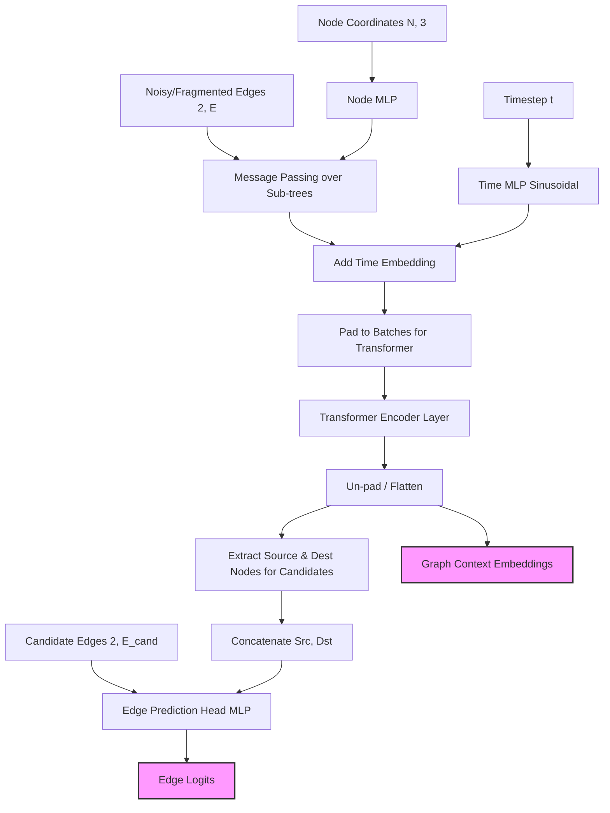
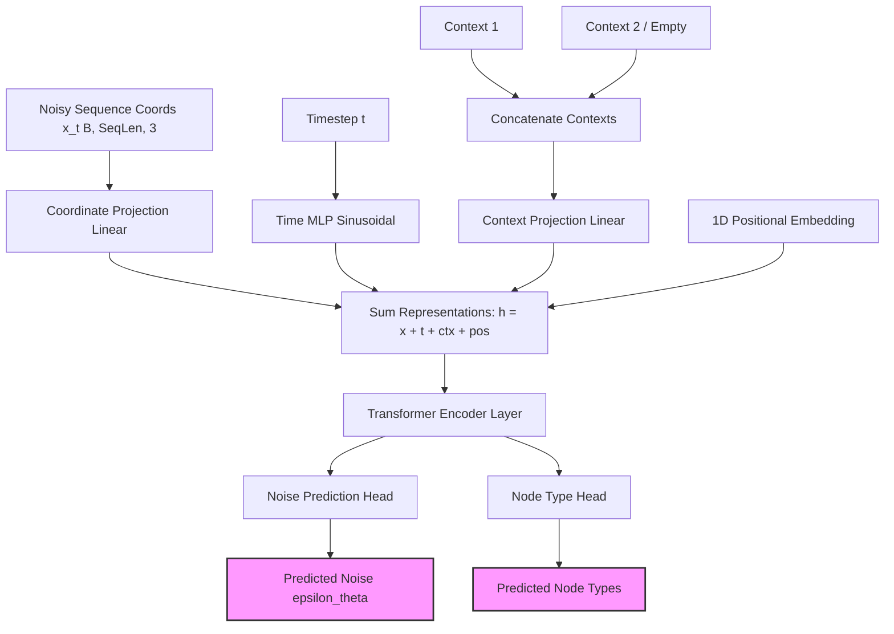

# NeuroDiffusion Architecture

This document outlines the architecture for the two primary generation models in the pipeline: the **Backward Diffusion Model** (for topological edge prediction) and the **Sequence Generator** (for generating the exact morphological sequences/coordinates).

## 1. Backward Diffusion Model (Topology Reconstruction)

The backward diffusion model is a specialized Graph Transformer. It takes disjoint, fragmented neuronal sub-trees (produced by the forward diffusion corruption) and uses global self-attention to exchange context between these fragments. It then predicts the probability of candidate edges to bridge the missing gaps.

## 2. Sequence Generator (Morphology Generation)

The sequence generator acts as a continuous DDPM (Denoising Diffusion Probabilistic Model). Rather than predicting edges, it generates the exact 3D coordinates along a neuronal branch. It is conditioned on the graph context extracted from the Backward Diffusion Model.

## How they interact
1. The **Backward Diffusion Model** evaluates a fragmented graph, predicts how it connects, and produces a highly descriptive `Graph Context Embedding` for those connected components.
2. The **Sequence Generator** takes that `Graph Context Embedding` as its conditional input (`Context 1` and `Context 2`), ensuring that the 3D morphology it generates natively respects the overall topological structure of the neuronal tree.
