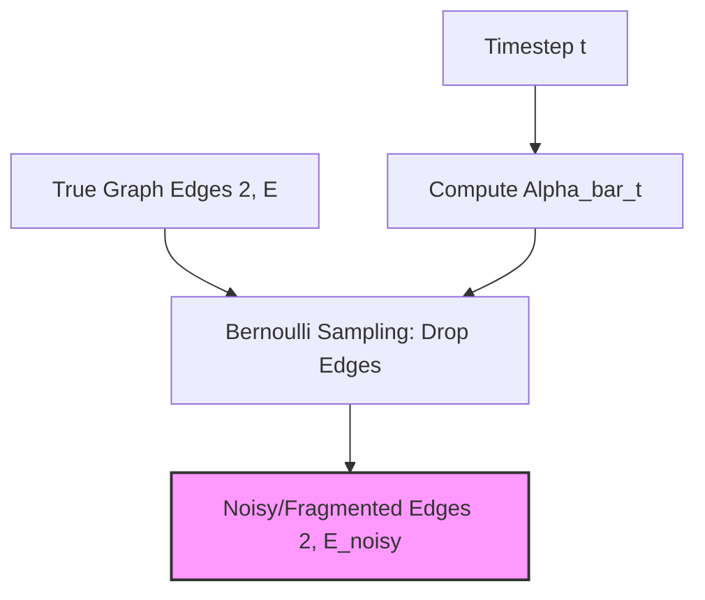
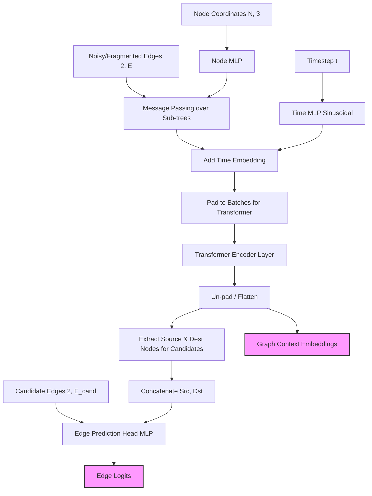
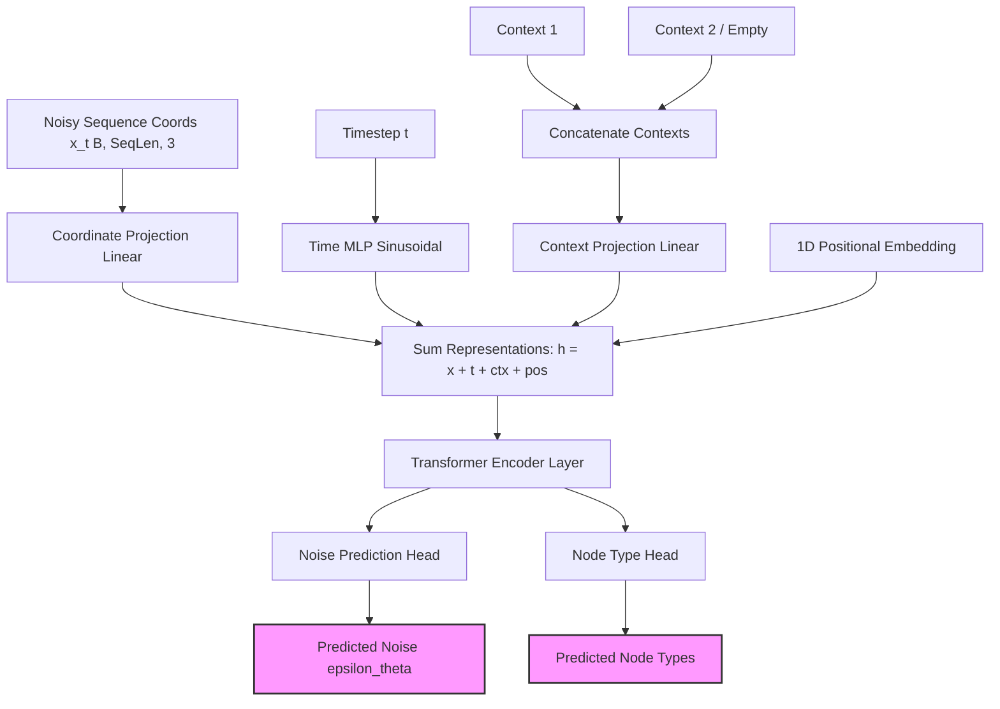
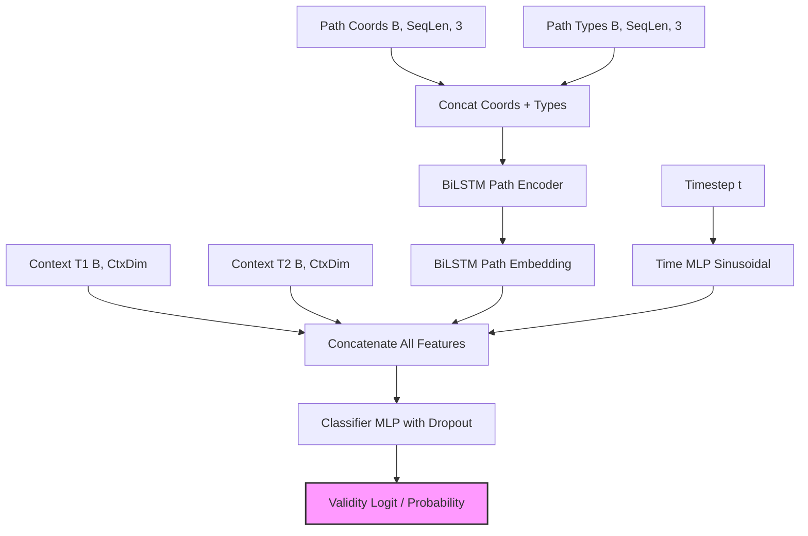

# NeuroDiffusion Architecture

This document outlines the architecture for the four primary models in the NeuroDiffusion pipeline:
1. **Forward Diffusion Model** (Edge corruption process)
2. **Backward Diffusion Model** (Topological edge prediction)
3. **Sequence Generator** (Morphological sequence generation)
4. **Heuristic Evaluator** (Validity scoring)

---

## 1. Forward Diffusion Model (Discrete Edge Corruption)

The discrete forward diffusion process simulates the fragmentation of neuronal trees. It takes a fully connected graph (tree) and progressively drops edges over time $t$ according to a cosine or linear noise schedule. 

---

## 2. Backward Diffusion Model (Topology Reconstruction)

The backward diffusion model is a specialized Graph Transformer. It takes disjoint, fragmented neuronal sub-trees (produced by the forward diffusion corruption) and uses global self-attention to exchange context between these fragments. It then predicts the probability of candidate edges to bridge the missing gaps.

---

## 3. Sequence Generator (Morphology Generation)

The sequence generator acts as a continuous DDPM (Denoising Diffusion Probabilistic Model). Rather than predicting edges, it generates the exact 3D coordinates along a neuronal branch. It is conditioned on the graph context extracted from the Backward Diffusion Model.

---

## 4. Heuristic Evaluator (Validity Scoring)

The Validity Heuristic Evaluator checks whether a generated morphological sequence correctly and biologically connects two sub-trees. It combines the contextual embeddings of the sub-trees, the sequence itself, and the diffusion timestep to produce a validity score.

---

## Overall Pipeline Flow
1. **Forward Diffusion Model** tears apart a complete neuronal graph.
2. The **Backward Diffusion Model** evaluates this fragmented graph, predicts how it connects (Topology), and produces a highly descriptive `Graph Context Embedding` for those connected components.
3. The **Sequence Generator** takes that `Graph Context Embedding` as its conditional input (`Context 1` and `Context 2`) and iteratively denoises a path to generate the 3D morphology between those sub-trees.
4. The **Heuristic Evaluator** acts as a final filter, taking the generated path and the original context to reject biologically impossible or topologically invalid connections.
