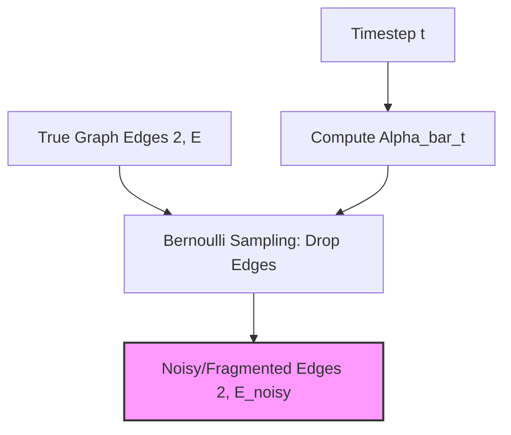
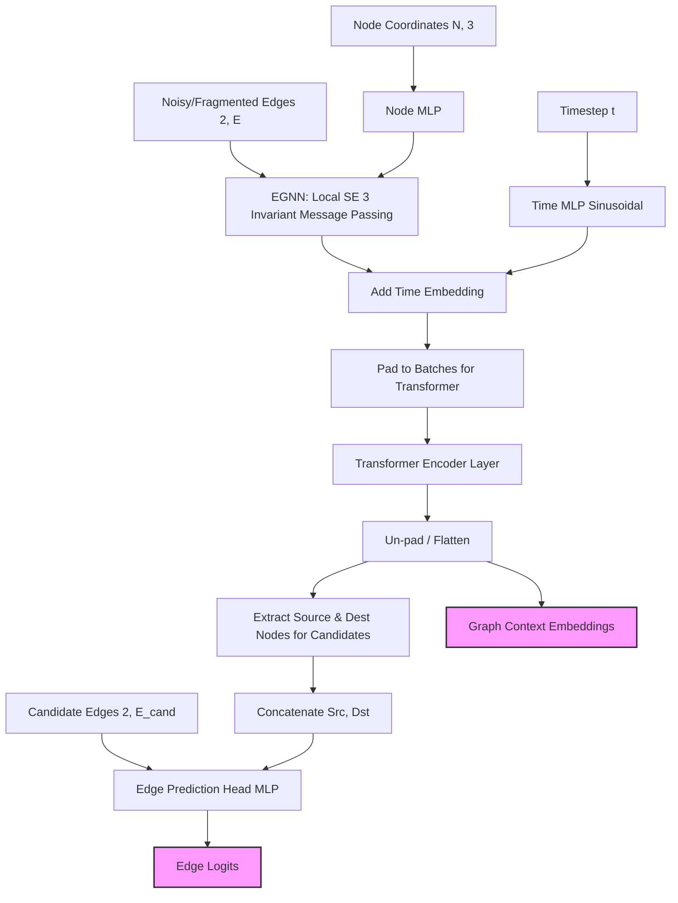
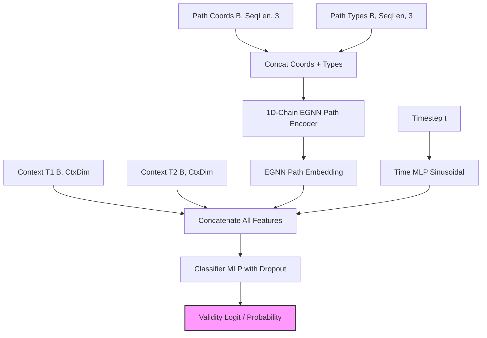
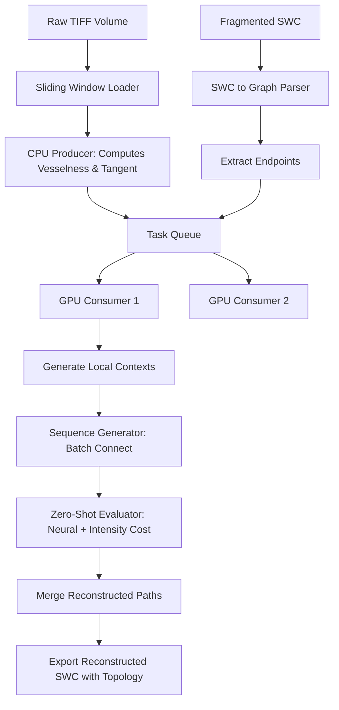

# NeuroDiffusion Architecture

This document outlines the architecture for the four primary models in the NeuroDiffusion pipeline:
1. **Forward Diffusion Model** (Edge corruption process)
2. **Backward Diffusion Model** (Topological edge prediction)
3. **Sequence Generator** (Morphological sequence generation)
4. **Heuristic Evaluator** (Validity scoring)

---

## 1. Forward Diffusion Model (Discrete Edge Corruption)

The discrete forward diffusion process simulates the fragmentation of neuronal trees. It takes a fully connected graph (tree) and progressively drops edges over time $t$ according to a cosine or linear noise schedule. 

---

## 2. Backward Diffusion Model (Topology Reconstruction)

The backward diffusion model is a hybrid EGNN and Graph Transformer. It takes disjoint, fragmented neuronal sub-trees (produced by the forward diffusion corruption), uses an Equivariant Graph Neural Network (EGNN) to extract local SE(3) invariant features, and then uses global self-attention to exchange context between these fragments. It then predicts the probability of candidate edges to bridge the missing gaps.

### Layer-wise Details:
- **`time_mlp`**: `TimestepEmbedding(128) -> Linear(128, 128) -> SiLU -> Linear(128, 128)`
- **`egnn`**: Equivariant Graph Neural Network (`num_layers=4`, `hidden_dim=128`). Operates locally on the fragmented input edges to extract SE(3) invariant node features.
- **`transformer`**: PyTorch `TransformerEncoder` (`num_layers=4`, `nhead=4`, `dim_feedforward=512`). Operates globally across the nodes.
- **`edge_head`**: `Linear(257, 128) -> SiLU -> Linear(128, 1)`. Takes concatenated source, destination, and scale-invariant log distance to predict logits.

---

## 3. Sequence Generator (Morphology Generation)

The sequence generator acts as a continuous DDPM (Denoising Diffusion Probabilistic Model). Rather than predicting edges, it generates the exact 3D coordinates along a neuronal branch. It uses a 1D-Chain EGNN to denoise the path equivariantly, conditioned on the graph context extracted from the Backward Diffusion Model.

### Layer-wise Details:
- **`time_mlp`**: `SinusoidalPositionEmbeddings(128) -> Linear(128, 256) -> GELU -> Linear(256, 128)`
- **`context_proj`**: `Linear(256, 128)`. Compresses the concatenated T1 and T2 contexts.
- **`egnn`**: `EGNN` (`num_layers=4`, `hidden_dim=128`). Operates as a 1D-Chain sequential EGNN to predict rotation-equivariant coordinate noise $\Delta x$.
- **`type_head`**: `Linear(128, 3)`. Predicts categorical node types (Continue, Branch, Terminate).

---

## 4. Heuristic Evaluator (Validity Scoring)

The Validity Heuristic Evaluator checks whether a generated morphological sequence correctly and biologically connects two sub-trees. It combines the contextual embeddings of the sub-trees, the sequence itself, and the diffusion timestep to produce a validity score.

### Layer-wise Details:
- **`time_mlp`**: `SinusoidalPositionEmbeddings(128) -> Linear(128, 128) -> SiLU`
- **`type_proj`**: `Linear(3, 128)`. Projects initial one-hot path types into hidden features.
- **`egnn`**: `EGNN` (`num_layers=2`, `hidden_dim=128`). Acts as a spatial path encoder over the generated sequence.
- **`classifier`**: `Linear(512, 256) -> BatchNorm1d(256) -> SiLU -> Dropout(0.2) -> Linear(256, 128) -> SiLU -> Linear(128, 1)`. Outputs the final scalar predicting the structural neural gap.

---

## Overall Pipeline Flow
1. **Forward Diffusion Model** tears apart a complete neuronal graph.
2. The **Backward Diffusion Model** evaluates this fragmented graph, predicts how it connects (Topology), and produces a highly descriptive `Graph Context Embedding` for those connected components.
3. The **Sequence Generator** takes that `Graph Context Embedding` as its conditional input (`Context 1` and `Context 2`) and iteratively denoises a path to generate the 3D morphology between those sub-trees.
4. The **Heuristic Evaluator** acts as a final filter, taking the generated path and the original context to reject biologically impossible or topologically invalid connections.

---

## 5. Volumetric Inference Pipeline

The end-to-end inference script (`inference/main.py`) integrates all trained models with raw biological image data.

