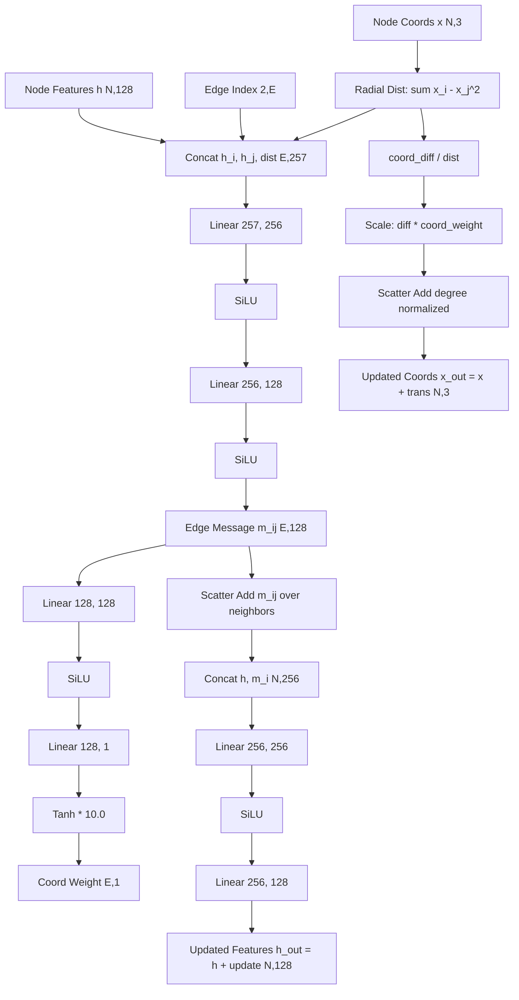
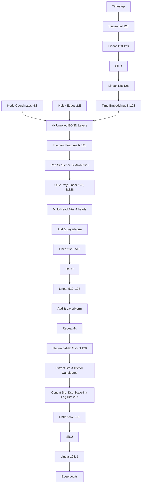
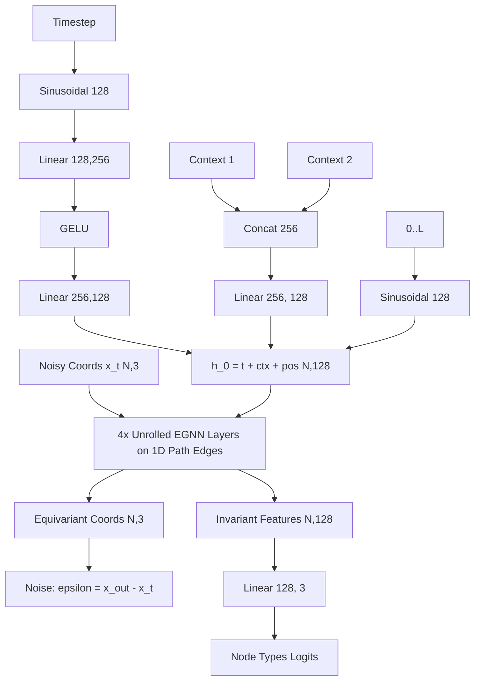
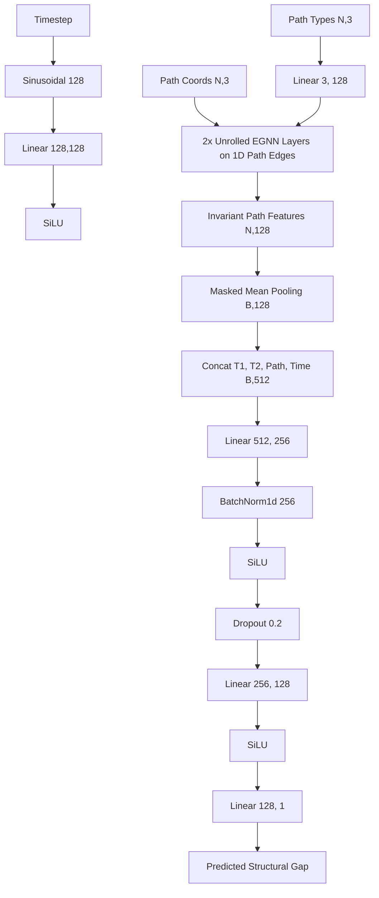

# Layer-wise Model Architecture

This document explicitly unrolls all major neural network blocks (EGNNs, Transformers, MLPs) down to their primitive PyTorch layers (Linear, SiLU, BatchNorm, etc.), providing a complete node-to-node operational trace for the NeuroDiffusion models.

## 1. EGNN Layer Unrolled (Equivariant Graph Neural Network)
This is the core local message-passing layer utilized across Backward Diffusion, Sequence Generation, and Heuristic Evaluation.

## 2. Backward Diffusion Model

## 3. Sequence Generator

## 4. Heuristic Evaluator

