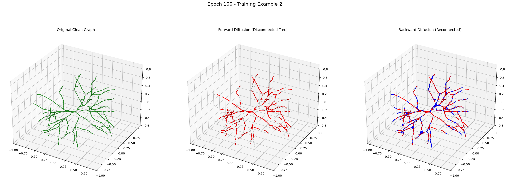

# Step 1: Forward Diffusion (Graph Fragmentation)
**Simulating Topological Destruction**

---

## Discrete Edge Corruption

Instead of continuous coordinate noise, NeuroDiffusion uses a **discrete diffusion process** over the graph topology $G = (V, E)$.

- **Initial State ($t=0$):** The neuronal tree is fully connected.
- **Corruption Process:** Edges are progressively dropped via a Bernoulli sampling process controlled by a noise schedule $\bar{\alpha}_t$.
- **Final State ($t \to T$):** The fully connected tree fractures into isolated, disconnected sub-trees (mimicking real-world tracing artifacts).

---

## Mathematical Formulation

The transition probability for an edge existing at timestep $t$ is given by:

$$ q(E_t | E_0) = \text{Bernoulli}(E_t; \bar{\alpha}_t \cdot E_0) $$

Where:
- $E_0$ is the pristine ground-truth edge set.
- $\bar{\alpha}_t$ decays from $1.0 \to (1.0 - \beta_{\text{end}})$ according to a predefined schedule (e.g., linear or cosine).

---

## Examples of Fragmented Topologies

---

## Hyperparameter Tuning: $\beta_{\text{end}}$

**Parameter:** `forward_diffusion.beta_end`
- This controls the terminal probability of an edge being dropped.
- **High `beta_end`:** Results in severely fragmented trees with massive gaps. Exposes the model to very hard examples during training, forcing it to learn long-range topological rules.
- **Low `beta_end`:** Useful for fine-tuning on mostly-intact datasets where fragments are closely clustered.
