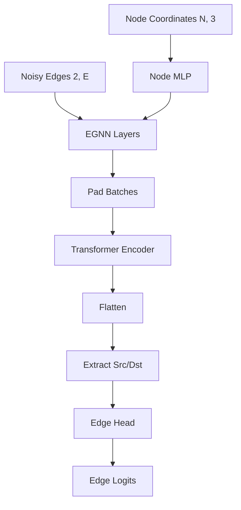
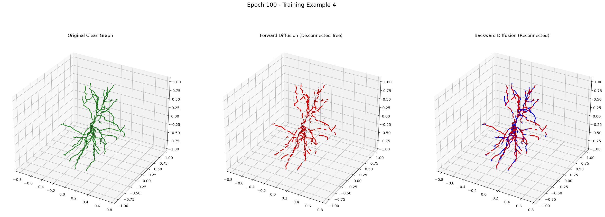

# Step 2: Backward Diffusion
**Topological Edge Prediction**

---

## The Objective

The Backward Diffusion Model is tasked with reversing the discrete corruption. 
Given a set of disconnected sub-trees and a set of candidate edges between them, it predicts the binary probability $p_{uv}$ that an edge should exist between nodes $u$ and $v$.

---

## Layer-wise Architecture: The Hybrid Model

The model is a hybrid combination of an **EGNN** (for local geometric features) and a **Graph Transformer** (for global context).

---

## Scale Invariance & Feature Concatenation

To predict an edge between source $u$ and destination $v$, the model concatenates:
- Source node invariant feature $h_u$
- Destination node invariant feature $h_v$
- **Scale-Invariant Log Distance:** 
  $\text{log\_dist} = \log(1 + \frac{||x_u - x_v||^2}{\text{Var}(X)})$

Dividing the absolute gap distance by the spatial variance of the given graph ensures the model performs flawlessly on 5-micron scale graphs and 500-micron scale graphs alike.

---

## Optimization: The Edge Loss

The model is optimized using **Binary Cross-Entropy with Logits** (`nn.BCEWithLogitsLoss`).

**Intra-batch Negative Sampling:** 
During the DDP training loop, the trainer automatically generates topologically invalid (negative) candidate edges. The model must learn to classify true ground-truth edges (Label `1`) versus these aggressively sampled negative edges (Label `0`).

---

## Example: Model Predictions

---

## Target Leakage & Laplacian PEs

**Critical Note:** Laplacian Positional Encodings (`lap_pe`) were strictly excluded from this architecture. 

Providing eigenvectors allows Graph Transformers to "cheat" and memorize topologies directly from the spectral decomposition. By relying purely on EGNN message passing, the model is forced to learn actual **3D structural branching rules**.
