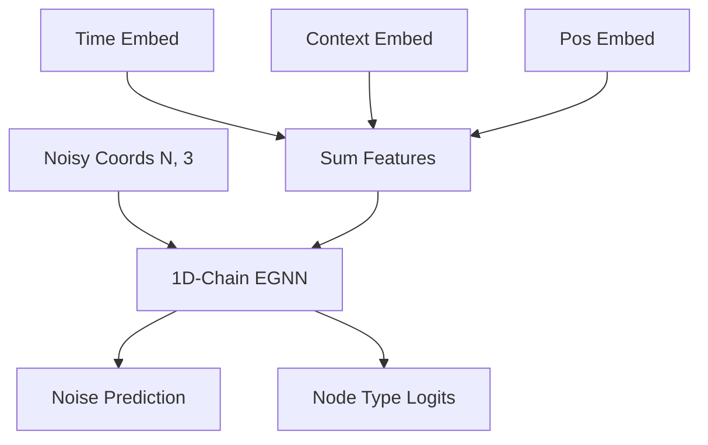

# Step 3: Sequence Generation
**Continuous 3D Morphology Synthesis**

---

## The Objective

Once the Backward Diffusion model predicts *that* two fragments connect, the **Sequence Generator** predicts *how*. 

It generates a continuous sequence of 3D coordinates $X_{1:L}$ that bridges the topological gap, conditional on the invariant contexts of the two fragments.

---

## The Denoising Process (DDPM)

The model functions as a continuous Denoising Diffusion Probabilistic Model.
- **Input:** Pure Gaussian noise $N(0, I)$ sampled into a 3D tensor of shape `(Batch, MaxLength, 3)`.
- **Conditioning:** The invariant Context Vectors ($c_1, c_2$) extracted from the Backward Diffusion Model.
- **Output:** A smooth, biologically plausible 3D curve tracing a neurite path.

---

## Layer-wise Architecture: 1D-Chain EGNN

---

## Optimization: Morphological Losses

The generation is optimized using two primary losses:
- **Coordinate Loss (Weight: 10.0):** Masked Mean Squared Error (`nn.MSELoss`) over the predicted coordinate noise vs the added Gaussian noise. The heavy weight prioritizes smooth, accurate paths.
- **Node Type Loss (Weight: 0.5):** Masked Cross-Entropy Loss for structural intents.

Padding masks ensure that variable-length branches do not corrupt the loss gradient.
