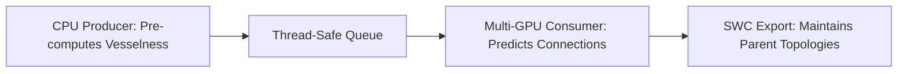
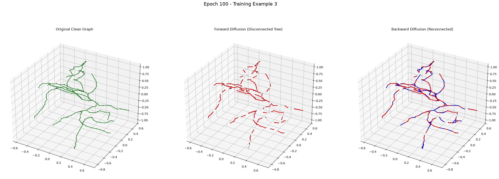

# Step 4: Zero-Shot Validation & Inference
**Sliding-Window Volumetric Reconstruction**

---

## The False Positive Problem

Generative models hallucinate. To prevent the pipeline from mistakenly connecting disjoint neurons or background artifacts, NeuroDiffusion implements a **Three-Layered Gauntlet**.

1. **Topological Gate:** The Backward model outputs $p \approx 0$ for structurally incompatible endpoints.
2. **Structural Gate:** The Heuristic Evaluator penalizes biologically absurd generated curves.
3. **Physical Gate:** The Intensity Cost ensures the generated curve overlaps with bright biological signals in the raw image.

---

## The Validity Heuristic Evaluator (Cost A)

Trained as a binary classifier/discriminator:
- **Architecture:** A 2-layer EGNN operating over the generated path sequence, concatenated with the fragment contexts. Outputs a scalar predicting the Structural Neural Gap.
- **Training:** Optimized via BCE against true biological paths (Label `1`) and corrupted/hallucinated paths (Label `0`).
- **Effect:** Heavy penalty for mathematically sound but biologically impossible structures (e.g., hairpin turns).

---

## Biological Intensity Path Integral (Cost B)

The ultimate physical ground-truth validation during live inference over TIFF stacks.

$$ \text{Cost}_B(X) = - \frac{10}{|X|} \sum_{i} \text{Vesselness}(x_i) \cdot |\langle \text{Tangent}(x_i), \text{StepDir}(x_i) \rangle| $$

- Evaluates if the path cuts through dark space (Low Vesselness).
- Evaluates if the path travels perpendicular to the actual physical neurites (Tangent Misalignment).

---

## End-to-End Inference Architecture

## Successfully Connected Neurons

